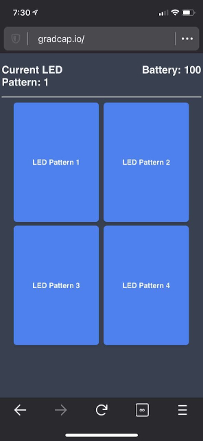

# Gradcap LED Controller

### Requirements
- Platformio
- Nodemcuv2 ESP8266 Microcontroller

### Building and Uploading
Plug in your ESP8266 and run `pio run -t upload` in order to build and upload. To monitor the device run `pio device monitor` in order to see serial debugging output in the terminal.

### Configuration
All program and pinout configurations can be done from the [`configuration.h`](https://github.com/dvigne/Gradcap/blob/master/include/configuration.h) file located in the [`include`](https://github.com/dvigne/Gradcap/tree/master/include) folder.

### Usage
Once uploaded, the ESP8266 will broadcast a wireless network that you may connect to. Once connected, you can direct your web browser to the URL specified by the [`DOMAIN_NAME`](https://github.com/dvigne/Gradcap/blob/1d6ee74ec0448dda0be8da414e1259c0a429bdd6/include/configuration.h#L28) configuration key.

This screen will show you the current LED pattern, battery percentage, and give you the ability to change the LED pattern on the fly.
